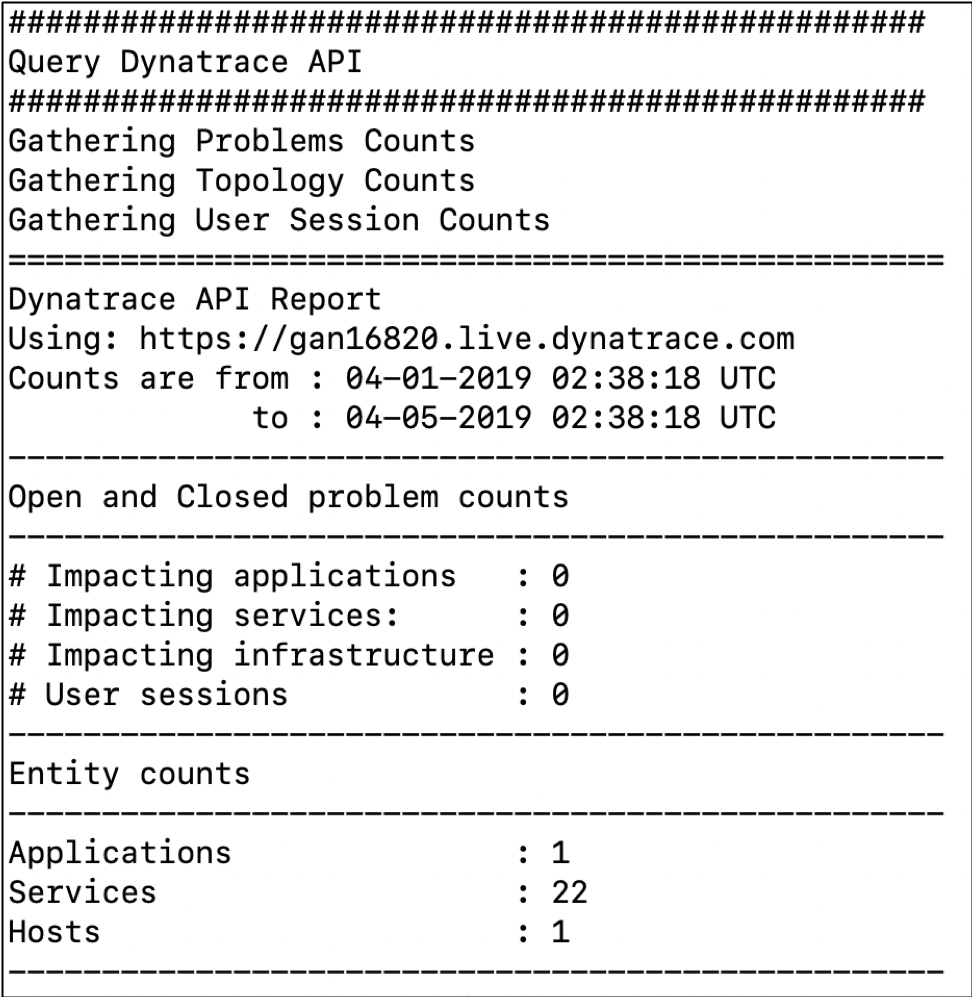
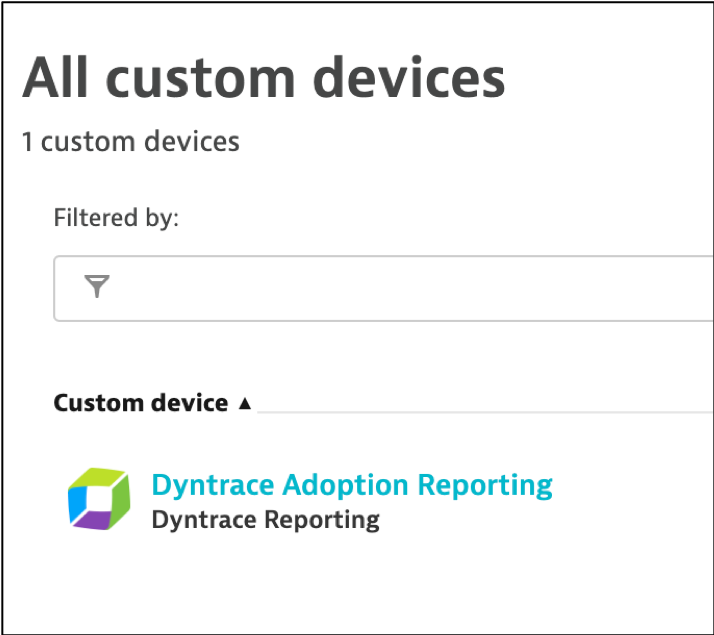
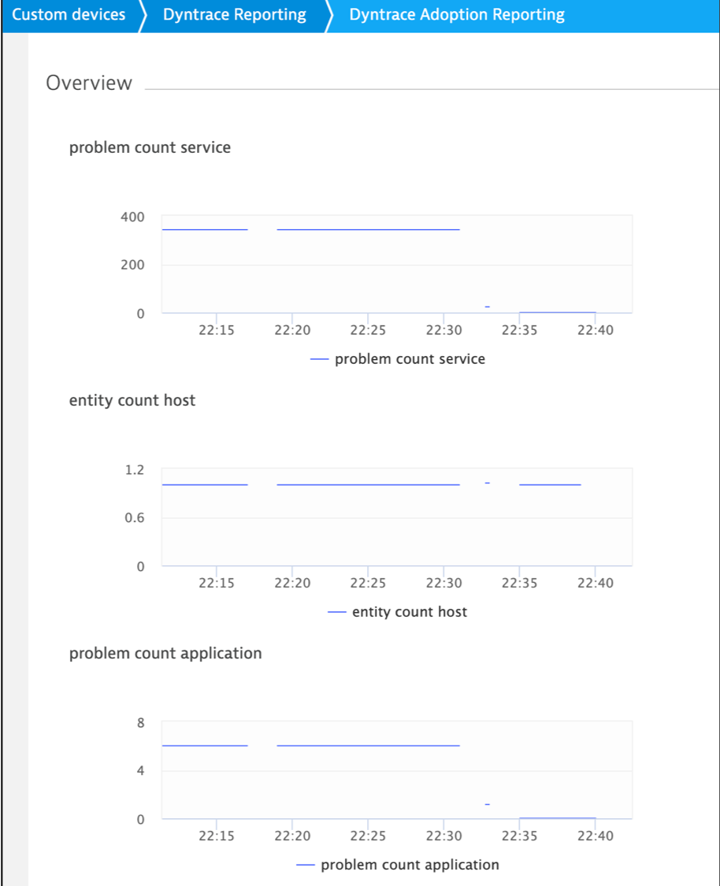
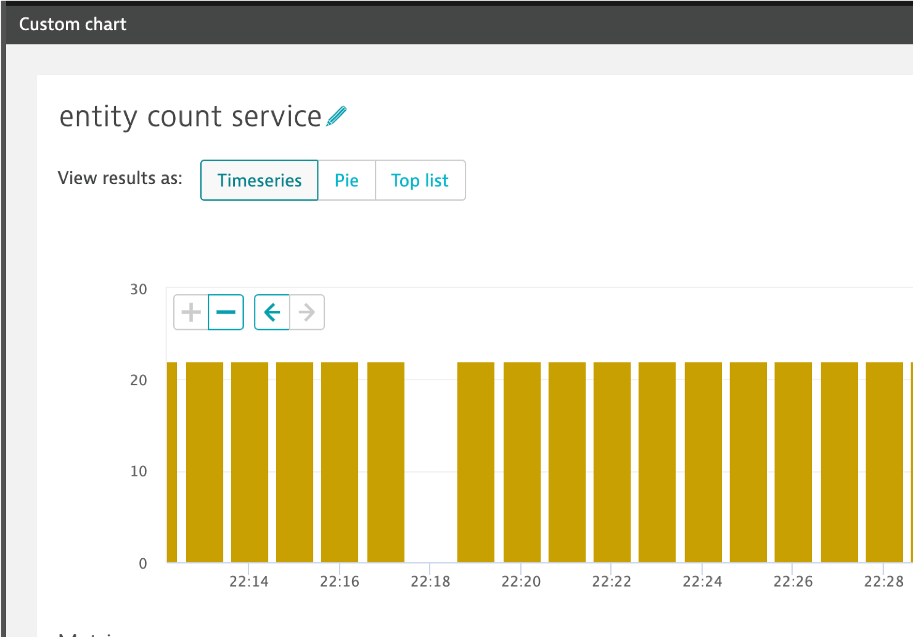

# Overview

This repo shows examples for how to use the [Dynatrace API](https://www.dynatrace.com/support/help/extend-dynatrace/dynatrace-api/) and [Dynatrace custom devices](https://www.dynatrace.com/support/help/extend-dynatrace/dynatrace-api/environment/topology-and-smartscape-api/topology-smartscape-api-custom-device/) for reporting.

Both examples use the ```queryDynatrace.lib``` to call the Dynatrace API to gather metrics. 
* Dynatrace problem count and user session counts are for the last 24 hours from the time script is run
* entity counts will be current for the time the script is run

# Prerequisites Setup

1. Install jquery utility -- [Windows/Mac](https://github.com/stedolan/jq/wiki/Installation) instructions or [Linux](https://stedolan.github.io/jq/download/)
1. copy as *creds.sav* as *creds.json*
1. Fill in your Dynatrace values
```
{
  "dynatraceUrl": "https://{your tenant}.live.dynatrace.com",
  "dynatraceApiToken": "",
  "relativeTimeframe": "day",
  "managementZone": ""
}
```
NOTE: this example is the SaaS dynatrace URL. Other API URL formats include:
* https://{your-domain}/e/{your-environment-id}
* xyz123.dynatrace-managed.com
* relative time frame can be any of the values listed in the "_comment" lines in the file
* Managgement zone is null by default. Management zones are integers found in your dynatrace tenant URL when filtered on a management zone. The file inputParameters.lib will check the validity of a management zone before executing.

## EXAMPLE #1) Output to terminal and CSV

This example will generate a text report to the terminal that uses the Dynatrace API to gather metrics and 
display them in the terminal. It will also generate CVS output that you can copy-n-paste into Excel.



To run this example:
1. Follow the instruction as described in the *Prerequisites Setup* section below 
1. run ```./dynatraceReport.sh``` 

NOTE: See "other files" section below for other files this script depends on

## EXAMPLE #2) Use Dynatrace Custom Device

This example will gather the same metrics as the report example above, but will publish it into a Dynatrace Custom device. 





Once in a custom device, you can use the Dynatace Web to view metrics or make a customer dashboard.



To run this example:
1. Follow the instruction as described in the *Prerequisites Setup* section below 
1. run ```./createCustomMetrics.sh``` - This will create the metrics to store the report data
1. run ```./addDeviceData.sh``` - this script will first call the Dynatrace API to gather metrics and then publish then to the custom device.
1. within Dynatrace, in the left side menu navigate to: 'Technologies'.   Then click on 'custom devices' and then click to view the new device
1. It might take a minute for data to appear.

Option to collect dacal
1. Run the ```loopAddDeviceData.sh``` script. This will call the ```addDeviceData.sh``` in a loop. See comments in this script for running it in the background.
2. You can also make a crontab entry to run the ```addDeviceData.sh``` script once a day. For example
```
# Run once a day at midnight
0 0 * * * cd <your path>/dt-api-reporting && ./addDeviceData.sh && echo "Crontab called addDeviceData @ "`date` >> addDeviceData.log
```

To remove this example:
1. run ```./deleteCustomMetrics.sh``` - this will remove all the custom metrics
1. the custom Device will automatically be removed after a few days once the device has no metric data

# Other files

* *metrics.lib* - this scripts provides a report that uses the Dynatrace API to gather metrics
* *queryDynatrace.lib* - this scripts provides a report that uses the Dynatrace API to gather metrics
* *creds.sav* - template you can copy as *creds.json*.  Add your Dynatrace 
* *inputParameters.lib* - creates epoch time in ms for relative time frame chosen and validates management zone


# Additional resources
* https://www.dynatrace.com/news/blog/register-custom-network-devices-smartscape-topology/

